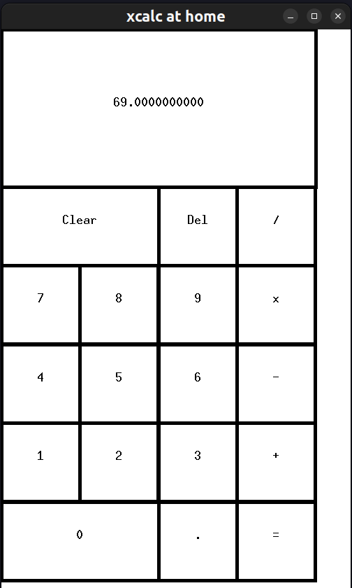

# `xcalc` at home

This is a simple calculator app drawn using the X client lib for X Server protocol.



## Motivation
I felt like I haven't touched C in a long time, and there's no better way to make
reviewing something old interesting by also learning something new at the same time...
I don't know any GUI frameworks for native apps on any of the big three OS's frankly, but I know that 
my system uses X11 for its windowing system and you could probably just use a programming lib
for it directly...How hard could it be?

> What did I get myself into? X11 as the windowing system standard is slowly getting replaced in favor of Wayland on these Linux distros...
> Who cares, build the thing! Learn!

## Getting Started

Have an X11 server running. Compile and run program:
```
make && ./main.out
```

## Edge Cases
"Intuitive" handling
- `1 . x 2 =` -> $1 \times 2 = 2$
> trailing decimal is essentially evaluated to N.0 or ignored.

- `. 2 x 1 =` -> $0.2 \times 1 = 0.2$
> preceding decimal is treated as having a 0 in front of it.

- `x / + - 1 2 + 1 2 =` -> $12 + 12 = 24$
> preceding operator is ignored

- `1 2 + 1 2 = + 1 2 =` -> $12 + 12 = 24 + 12 = 36$
> results from previous calculations can be used as the first operand to an additional operator.

Slightly less obvious behavior, so pointing it out.
- `1 . 1 . x 2 =` -> $1.1 \times 2 = 2.2$
- `1 . 1 . 3 . 4 . 2 . 1 . x 2 =` -> $1.13421 \times 2 = 2.26842$
> Extra decimals are ignored. This looks weird, but the GUI will visually give feedback to the user
> that the extra decimals are clearly not registered.

- `1 2 + 1 2 = 1 2 + 1 2 =` -> $12 + 12 = 24; 12 + 12 = 24$
> $12 + 12$ is evaluated twice, and we only see both results.
> The first evaluation is shown immediately once `=` is hit, and then as soon as the next `1` is inputted
> the previous result `24` will not be seen anymore.

- `1 2 + / * 1 2 =` -> $12 \times 12 = 144$
> We take the last operator inputted when waiting for the second operand to be inputted.

- `1 + 1 * 2 =` -> $(1+1) * 2 = 4$
- `1 * 2 + 1 / 1 =` -> $((1 * 2) + 1) / 1 = 3 / 1 = 3$
> The values are always evaluated from left to right, because we eagerly evaluate the forms `a op b`.

- `1 + 1 * + * / - 2` -> $(1 + 1) - 2 = 0$
> Follows same logic as above case but this also makes clear that previous evaluations become operand 1 for next operator and operand inputs.

I might not have catched all the weird edge cases, but this is why this is `xcalc-at-home` and not the `xcalc` you get at the store!

## Resources
- https://www.youtube.com/watch?v=d2E7ryHCK08
- https://stackoverflow.com/questions/10792361/how-do-i-gracefully-exit-an-x11-event-loop
- https://tronche.com/gui/x/xlib
- https://xopendisplay.hilltopia.ca/2009/Mar/Xlib-tutorial-part-9----Buttons.html
- https://man.archlinux.org/man/extra/libx11/XEvent.3.en
- Claude 3.5 Sonnet 
- https://www.cl.cam.ac.uk/~mgk25/ucs/keysymdef.h
